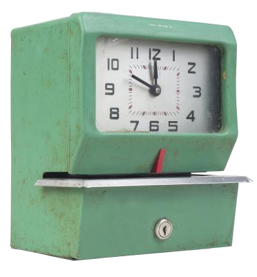

# SH-PUNCH

Time tracking command line utility.

## Help

punch

    Usage: punch COMMAND [PUNCH-FILE]
    
    Command line punching utility.
    
    ... show   : Show honored environment variables.
    
    ... in     : Register one's arrival to work.
    ... out    : Register one's departure from work.
    ... view   : View today's punch file.
    ... time   : View the time you worked today.
    
    ... edit   : Edit today's punch file.
    ... file   : Print today's punch file.
    ... status : Print current status, can be "in" or "out".
    
    ... note TEXT : Add a note to the punch file.
    
    Examples:
    
        > punch in   : You start working.
        > punch out  : You finished or took a break.
        > punch time : View how much you worked today.

punch-files

    Usage: punch-files ...
    
    ... files : Print all punch file pathnames.
    ... hours : Print day/worked hour summary.

## Collaborating

For making bug reports, feature requests and donations visit
one of the following links:

1. [gemini://harkadev.com/oss/](gemini://harkadev.com/oss/)
2. [https://harkadev.com/oss/](https://harkadev.com/oss/)

